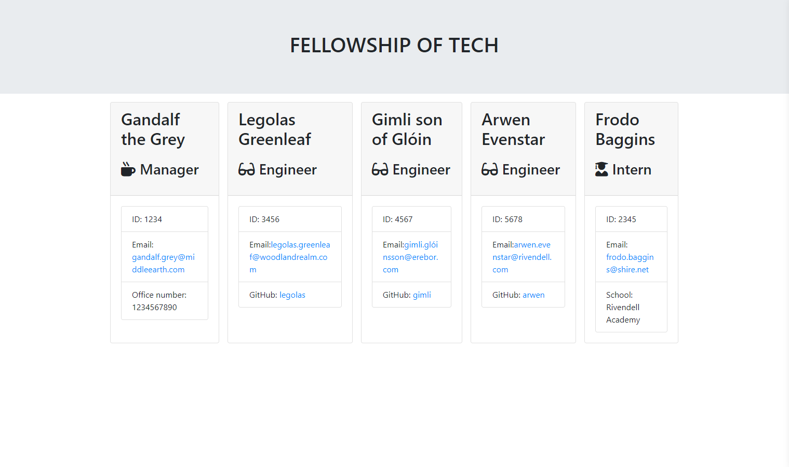
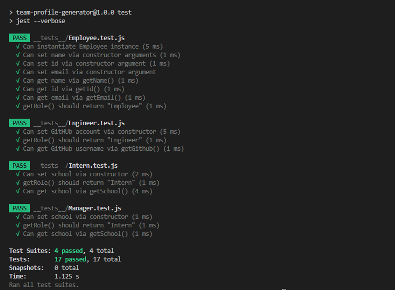
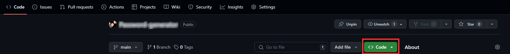
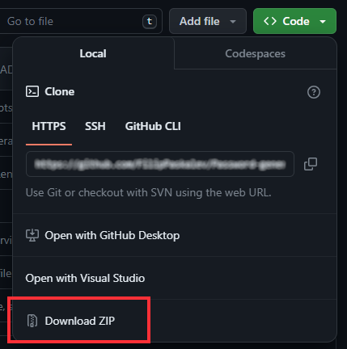

# Team-Profile-Generator

[](https://jestjs.io/) [](https://www.w3.org/Style/CSS/Overview.en.html) [](https://jsdoc.app/) [](https://html.com/) [](https://www.javascript.com) [](https://www.npmjs.com/package/chalk) [](https://www.edx.org/) [](https://www.npmjs.com/package/inquirer) [](https://prettier.io/) [](https://opensource.org/license/mit) [](https://git-scm.com/) 
[](https://github.com/)

- [Team-Profile-Generator](#team-profile-generator)
  - [Description](#description)
    - [User story](#user-story)
      - [I want to be able to](#i-want-to-be-able-to)
      - [Features](#features)
    - [Visual presentation](#visual-presentation)
      - [Simple live demo](#simple-live-demo)
      - [Mock-Up](#mock-up)
      - [App photos](#app-photos)
      - [Tests](#tests)
      - [Terminal app video preview](#terminal-app-video-preview)
  - [Usage](#usage)
  - [Installation](#installation)
    - [Option 1 - Download](#option-1---download)
    - [Option 2 - Clone project](#option-2---clone-project)
  - [Classes](#classes)
  - [Tests](#tests-1)
  - [Resources](#resources)
    - [NPM](#npm)
    - [JavaScript](#javascript)
    - [Jest](#jest)
    - [inquirer](#inquirer)
    - [Prettier](#prettier)
    - [Chalk](#chalk)
    - [Bootstrap](#bootstrap)
  - [Dependencies](#dependencies)
    - [JSDoc](#jsdoc)
    - [Prettier](#prettier-1)
    - [Chalk](#chalk-1)
    - [inquirer](#inquirer-1)
    - [Jest](#jest-1)
  - [Tools and extensions](#tools-and-extensions)
    - [Visual Studio Code](#visual-studio-code)
    - [VS Code Counter](#vs-code-counter)
  - [Technologies](#technologies)
  - [Project structure](#project-structure)
  - [Statistics](#statistics)
    - [Files](#files)
    - [Languages](#languages)
    - [Directories](#directories)
  - [Contributing](#contributing)
  - [Questions](#questions)
  - [License](#license)

## Description

This Node.js command-line application allows you to generate a webpage that displays basic information about your software engineering team. It prompts the user to input details about the team members, including the manager, engineers, and interns, and then generates an HTML file based on the provided information.

### User story

As a team manager, I require a convenient way to compile and access essential information about my software engineering team. This tool enables me to swiftly generate a webpage displaying key details, such as names, roles, email addresses, and GitHub profiles, for each team member. This streamlines communication and collaboration within the team, enhancing productivity and efficiency.

#### I want to be able to

- Input the details of the team manager, including their name, employee ID, email address, and office number.
- Add engineers to the team, including their name, ID, email, and GitHub username.
- Add interns to the team, including their name, ID, email, and school they are attending.
- Finish building the team when all necessary members have been added.
- Have an HTML file generated automatically containing all the team members' information, which I can refer to later for reference.

#### Features

- Utilizes Node.js for command-line interface.
- Prompts users for information about each team member.
- Supports different roles within the team, including managers, engineers, and interns.
- Automatically generates an HTML webpage based on the provided information.
- Includes tests to ensure the correctness and functionality of the application.

### Visual presentation

#### Simple live demo

[Click here to open the demo](https://filippaskalev.github.io/Team-Profile-Generator/)

#### Mock-Up


#### App photos



#### Tests



#### Terminal app video preview


## Usage

1. Clone the repository to your local machine.
2. Navigate to the project directory in your terminal.
3. Install dependencies using ```npm install```.
4. Run the application using ```npm start```.
5. Follow the prompts to input information about each team member.
6. Once all information is provided, the application will generate an HTML file named ```team.html``` in the ```output``` directory.

## Installation

### Option 1 - Download

Download the project from GitHub [repository](https://github.com/FilipPaskalev/Team-Profile-Generator.git) on your local machine.

1. Open GitHub repository. [(link to repository)](https://github.com/FilipPaskalev/Team-Profile-Generator.git)

2. Select ```Code``` from top navigation section. (reference on the image below) 👇

    

3. Select ```<> Code``` dropdown button from sub section. (reference on the image below) 👇

    

4. Select ```Download ZIP``` from dropdown menu to download project in .zip format. (reference on the image below) 👇

    

5.  Unzip the project. 

    > [!TIP]
    > You can use 7-Zip if you don't have file archiver. 
    >**7-Zip** is **free software** with **open source**. The most of the code is under the **GNU LGPL** license. Some parts of the code are under the BSD 3-clause License. Also there is unRAR license restriction for some parts of the code. Read [7-Zip License](https://www.7-zip.org/license.txt) information. 
    > Download the application from [official website](https://www.7-zip.org/).

6.  Open project with VS Code or other IDE.

### Option 2 - Clone project

1. On GitHub.com, navigate to the main page of the repository. [(link to repository)](https://github.com/FilipPaskalev/Team-Profile-Generator.git).

2. Above the list of files, click  Code. (reference on the image below) 👇

    

3. Copy the URL for the repository.
- To clone the repository using HTTPS, under "HTTPS", click <svg version="1.1" fill="#0F66B8" width="16" height="16" viewBox="0 0 16 16" aria-label="Copy to clipboard" role="img"><path d="M3.626 3.533a.249.249 0 0 0-.126.217v9.5c0 .138.112.25.25.25h8.5a.25.25 0 0 0 .25-.25v-9.5a.249.249 0 0 0-.126-.217.75.75 0 0 1 .752-1.298c.541.313.874.89.874 1.515v9.5A1.75 1.75 0 0 1 12.25 15h-8.5A1.75 1.75 0 0 1 2 13.25v-9.5c0-.625.333-1.202.874-1.515a.75.75 0 0 1 .752 1.298ZM5.75 1h4.5a.75.75 0 0 1 .75.75v3a.75.75 0 0 1-.75.75h-4.5A.75.75 0 0 1 5 4.75v-3A.75.75 0 0 1 5.75 1Zm.75 3h3V2.5h-3Z"></path></svg>
- To clone the repository using an SSH key, including a certificate issued by your organization's SSH certificate authority, click SSH, then click <svg version="1.1" fill="#0F66B8" width="16" height="16" viewBox="0 0 16 16" aria-label="Copy to clipboard" role="img"><path d="M3.626 3.533a.249.249 0 0 0-.126.217v9.5c0 .138.112.25.25.25h8.5a.25.25 0 0 0 .25-.25v-9.5a.249.249 0 0 0-.126-.217.75.75 0 0 1 .752-1.298c.541.313.874.89.874 1.515v9.5A1.75 1.75 0 0 1 12.25 15h-8.5A1.75 1.75 0 0 1 2 13.25v-9.5c0-.625.333-1.202.874-1.515a.75.75 0 0 1 .752 1.298ZM5.75 1h4.5a.75.75 0 0 1 .75.75v3a.75.75 0 0 1-.75.75h-4.5A.75.75 0 0 1 5 4.75v-3A.75.75 0 0 1 5.75 1Zm.75 3h3V2.5h-3Z"></path></svg>
- To clone a repository using GitHub CLI, click GitHub CLI, then click <svg version="1.1" fill="#0F66B8" width="16" height="16" viewBox="0 0 16 16" aria-label="Copy to clipboard" role="img"><path d="M0 6.75C0 5.784.784 5 1.75 5h1.5a.75.75 0 0 1 0 1.5h-1.5a.25.25 0 0 0-.25.25v7.5c0 .138.112.25.25.25h7.5a.25.25 0 0 0 .25-.25v-1.5a.75.75 0 0 1 1.5 0v1.5A1.75 1.75 0 0 1 9.25 16h-7.5A1.75 1.75 0 0 1 0 14.25Z"></path><path d="M5 1.75C5 .784 5.784 0 6.75 0h7.5C15.216 0 16 .784 16 1.75v7.5A1.75 1.75 0 0 1 14.25 11h-7.5A1.75 1.75 0 0 1 5 9.25Zm1.75-.25a.25.25 0 0 0-.25.25v7.5c0 .138.112.25.25.25h7.5a.25.25 0 0 0 .25-.25v-7.5a.25.25 0 0 0-.25-.25Z"></path></svg> (reference on the image below) 👇

    

1. Open Git Bash.

2. Change the current working directory to the location where you want the cloned directory.

3. Type ```git clone```, and then paste the URL you copied earlier.

    ```
    git clone https://github.com/FilipPaskalev/Team-Profile-Generator.git
    ```

4. Press Enter to create your local clone.

    ```
    $ git clone https://github.com/FilipPaskalev/Team-Profile-Generator.git
    > Cloning into `Spoon-Knife`...
    > remote: Counting objects: 10, done.
    > remote: Compressing objects: 100% (8/8), done.
    > remove: Total 10 (delta 1), reused 10 (delta 1)
    > Unpacking objects: 100% (10/10), done.
    ```

## Classes

This application utilizes classes for each team member:

```Employee```: Parent class with properties and methods for **name**, **ID**, **email**, and **role**.

```Manager```: Extends Employee with an additional property for **office number** and an **overridden getRole()** method.

```Engineer```: Extends Employee with an additional property for **GitHub username** and an **overridden getRole()** method.

```Intern```: Extends Employee with an additional property for **school** and an **overridden getRole** method.

```AppEngine```: Singleton that runs all operation for the app.

## Tests

Unit tests for each class are provided in the ```__tests__``` directory. Ensure that all tests pass using ```Jest```.

```
> team-profile-generator@1.0.0 test
> jest --verbose

 PASS  __tests__/Employee.test.js
  √ Can instantiate Employee instance (5 ms)
  √ Can set name via constructor arguments (1 ms)
  √ Can set id via constructor argument (1 ms)
  √ Can set email via constructor argument
  √ Can get name via getName() (1 ms)
  √ Can get id via getId() (1 ms)
  √ Can get email via getEmail() (1 ms)
  √ getRole() should return "Employee" (1 ms)

 PASS  __tests__/Engineer.test.js
  √ Can set GitHUb account via constructor (5 ms)
  √ getRole() should return "Engineer" (1 ms)
  √ Can get GitHub username via getGithub() (1 ms)

 PASS  __tests__/Intern.test.js
  √ Can set school via constructor (2 ms)
  √ getRole() should return "Intern" (1 ms)
  √ Can get school via getSchool() (4 ms)

 PASS  __tests__/Manager.test.js
  √ Can set school via constructor (1 ms)
  √ getRole() should return "Intern" (1 ms)
  √ Can get school via getSchool() (1 ms)

Test Suites: 4 passed, 4 total
Tests:       17 passed, 17 total
Snapshots:   0 total
Time:        1.125 s
Ran all test suites.
```

## Resources

### NPM

[Link 1](https://www.geeksforgeeks.org/introduction-to-npm-scripts) | 
[Link 2](https://docs.npmjs.com/cli/v10/using-npm/scripts) | 
[Link 3](https://docs.npmjs.com/cli/v6/commands/npm-test) | 
[Link 4](https://docs.npmjs.com/cli/v6/commands/npm-start) | 
[Link 5](https://www.knowledgehut.com/blog/web-development/package-json-scripts-node-js) | 
[Link 7](https://codedamn.com/news/nodejs/remove-npm-package) | 
[Link 8](https://docs.npmjs.com/uninstalling-packages-and-dependencies)

### JavaScript

[Link 1](https://www.sohamkamani.com/javascript/enums/) | 
[Link 2](https://developer.mozilla.org/en-US/docs/Web/JavaScript/Reference/Classes/constructor) | 
[Link 3](https://developer.mozilla.org/en-US/docs/Web/JavaScript/Guide/Using_classes) | 
[Link 4](https://developer.mozilla.org/en-US/docs/Web/JavaScript/Reference/Classes) | 
[Link 5](https://developer.mozilla.org/en-US/docs/Web/JavaScript/Reference/Functions/set) | 
[Link 6](https://developer.mozilla.org/en-US/docs/Web/JavaScript/Reference/Classes/Static_initialization_blocks) | 
[Link 7](https://developer.mozilla.org/en-US/docs/Web/JavaScript/Reference/Classes/constructor#examples) |
[Link 8](https://stackoverflow.com/questions/21194934/how-to-create-a-directory-if-it-doesnt-exist-using-node-js) |
[Link 9](https://stackoverflow.com/questions/13696148/node-js-create-folder-or-use-existing) |
[Link 10](https://nodejs.org/en/learn/manipulating-files/reading-files-with-nodejs)
[Link 11](https://www.simplilearn.com/tutorials/javascript-tutorial/email-validation-in-javascript) | 
[Link 12](https://emaillistvalidation.com/blog/email-validation-in-javascript-using-regular-expressions-the-ultimate-guide/) | 
[Link 13](https://woocoders.com/how-to-validate-email-in-js/) | 
[Link 14](https://www.youtube.com/watch?v=UQnEWtA9l1A) | 
[Link 15](https://javascript.plainenglish.io/validate-phone-number-in-javascript-9528fa93a7f0) | 
[Link 16](https://www.javascript-coder.com/form-validation/javascript-form-validation-phone-number/) | 
[Link 17](https://stackoverflow.com/questions/4338267/validate-phone-number-with-javascript)

### Jest

[Link 1](https://jestjs.io/docs/cli#--testnamepatternregex) | 
[Link 2](https://jestjs.io/docs/configuration) | 
[Link 3](https://jestjs.io/docs/setup-teardown)

### inquirer

[Link 1](https://github.com/sboudrias/Inquirer.js) | 
[Link 2](https://www.npmjs.com/package/inquirer/v/8.0.0) | 
[Link 3](https://www.digitalocean.com/community/tutorials/nodejs-interactive-command-line-prompts) | 
[Link 4](https://github.com/SBoudrias/Inquirer.js#plugins) | 
[Link 5](https://github.com/SBoudrias/Inquirer.js/blob/master/packages/inquirer/README.md)

### Prettier

[Link 1](https://prettier.io/docs/en/configuration.html) | 
[Link 2](https://prettier.io/docs/en/options.html#print-width) | 
[Link 3](https://prettier.io/docs/en/options.) | 
[Link 4](html#:~:text=For%20readability%20we%20recommend%20against,up%20long%20lines%20for%20readability.) | 
[Link 5](https://stackoverflow.com/questions/45404823/how-to-remove-semicolons-in-prettier) | 
[Link 6](https://prettier.io/docs/en/ignore.html)

### Chalk
[link 1](https://www.npmjs.com/package/chalk) | 
[Link 2](https://github.com/chalk/chalk) | 
[link 3](https://github.com/chalk/chalk#readme) | 
[Link 4](https://stackoverflow.com/questions/70309135/chalk-error-err-require-esm-require-of-es-module) | 
[Link 5](https://geshan.com.np/blog/2022/10/npm-chalk/#:~:text=NPM%20chalk%20is%20a%20third,Terminal%20string%20styling%20done%20right) | 
[Link 6](https://www.npmjs.com/package/chalk/v/4.1.2)

### Bootstrap
[Link 1](https://getbootstrap.com/docs/4.0/utilities/spacing/) | 
[Link 2](https://getbootstrap.com/docs/4.3/utilities/sizing/)

## Dependencies

### JSDoc

[JSDoc 3](https://jsdoc.app/about-getting-started) is an API documentation generator for JavaScript, similar to Javadoc. You add documentation comments directly to your source code, right alongside the code itself. The JSDoc tool will scan your source code and generate an HTML documentation website for you.

JSDoc's purpose is to document the API of your JavaScript application or library. It is assumed that you will want to document things like modules, namespaces, classes, methods, method parameters, and so on.

### Prettier

Prettier is an opinionated code formatter with support for:

- JavaScript (including experimental features)
- JSX
- Angular
- Vue
- Flow
- TypeScript
- CSS, Less, and SCSS
- HTML
- Ember/Handlebars
- JSON
- GraphQL
- Markdown, including GFM and MDX v1
- YAML

It removes all original styling* and ensures that all outputted code conforms to a consistent style. (See this [blog post](https://archive.jlongster.com/A-Prettier-Formatter))

Prettier takes your code and reprints it from scratch by taking the line length into account.

### Chalk

[NPM chalk](https://www.npmjs.com/package/chalk/v/5.3.0) is a third-party Node.js module that is used to add colour and styling to text on the command-line output. It also allows creating your own themes for your Node.js project. As per the Chalk GitHub page, it is: 

>Terminal string styling done right

Chalk supports multiple text styles with backgrounds supporting different colours and formatting. For instance, you can show text in red colour with a grey background that is bold and underlined. The chalk module is easy to install and use, depending on your terminal colours it can support a lot of colours.

It is an actively maintained project without any dependencies. Chalk also has an expressive API and it is a performant library. In the next part, you will know about the popularity of the NPM chalk module.

### inquirer

Inquirer is an [NPM](https://www.npmjs.com/package/inquirer/v/9.2.15?activeTab=readme#documentation) package that provides an easy way to capture user input in your Node.js command line interface applications. It provides several methods for asking questions and returning answers from the user that can be accessed by a .then promise function.

### Jest

> "[Jest](https://jestjs.io/) is a JavaScript testing framework designed to ensure correctness of any JavaScript codebase. It allows you to write tests with an approachable, familiar and feature-rich API that gives you results quickly.
Jest is well-documented, requires little configuration and can be extended to match your requirements.
Jest makes testing delightful" - Jest Core Team

## Tools and extensions

### Visual Studio Code

[Visual Studio Code](https://code.visualstudio.com/) is a lightweight but powerful source code editor which runs on your desktop and is available for Windows, macOS and Linux. It comes with built-in support for JavaScript, TypeScript and Node.js and has a rich ecosystem of extensions for other languages and runtime (such as C++, C#, Java, Python, PHP, Go, .NET).

### VS Code Counter

[VS Code extension](https://marketplace.visualstudio.com/items?itemName=uctakeoff.vscode-counter) counts blank lines, comment lines, and physical lines of source code in many programming languages. This extension uses other language extensions to determine the line of code. Therefore, you may need to install the language extension to support a new language. Conversely, as the number of language extensions increases, the range of support for this feature also increases.

## Technologies
- [Node.js *v21.6.1*](https://nodejs.org/en)
- [Inquirer *v8.0.0*](https://www.npmjs.com/package/inquirer/v/8.0.0#documentation)
- [Jest *v29.7.0*](https://jestjs.io/)
- [HTML](https://html.com/)
- [Bootstrap](https://getbootstrap.com/)
- [CSS](https://www.w3.org/Style/CSS/Overview.en.html)
- [JavaScript](https://www.javascript.com/)
- [Prettier *v3.2.5*](https://prettier.io/)
- [Git](https://git-scm.com/)
- [JSDoc *v4.0.2*](https://jsdoc.app/)
- 
## Project structure

```
|   app.js
|   jest.config.js
|   LICENSE
|   package-lock.json
|   package.json
|   README.md
+---.vscode
+---assets
+---lib
|   +---employees
|   |       Employee.js
|   |       Engineer.js
|   |       Intern.js
|   |       Manager.js
|   +---engine
|   |       AppEngine.js
|   |       promptFilters.js
|   |       promptValidators.js
|   \---enum
|           EnumEmployeeType.js
+---output
|       team.html
+---src
|       page-template.js
\---__tests__
        Employee.test.js
        Engineer.test.js
        Intern.test.js
        Manager.test.js
```

## Statistics

### Files
| filename | language | code | comment | blank | total |
| :--- | :--- | ---: | ---: | ---: | ---: |
| [.prettierignore](/.prettierignore) | Ignore | 2 | 2 | 1 | 5 |
| [.prettierrc.json](/.prettierrc.json) | JSON | 7 | 0 | 1 | 8 |
| [README.md](/README.md) | Markdown | 285 | 0 | 102 | 387 |
| [__tests__/Employee.test.js](/__tests__/Employee.test.js) | JavaScript | 37 | 0 | 18 | 55 |
| [__tests__/Engineer.test.js](/__tests__/Engineer.test.js) | JavaScript | 18 | 0 | 8 | 26 |
| [__tests__/Intern.test.js](/__tests__/Intern.test.js) | JavaScript | 18 | 0 | 8 | 26 |
| [__tests__/Manager.test.js](/__tests__/Manager.test.js) | JavaScript | 25 | 0 | 10 | 35 |
| [app.js](/app.js) | JavaScript | 14 | 4 | 3 | 21 |
| [jest.config.js](/jest.config.js) | JavaScript | 5 | 139 | 55 | 199 |
| [lib/employees/Employee.js](/lib/employees/Employee.js) | JavaScript | 22 | 43 | 7 | 72 |
| [lib/employees/Engineer.js](/lib/employees/Engineer.js) | JavaScript | 24 | 42 | 5 | 71 |
| [lib/employees/Intern.js](/lib/employees/Intern.js) | JavaScript | 24 | 45 | 5 | 74 |
| [lib/employees/Manager.js](/lib/employees/Manager.js) | JavaScript | 24 | 48 | 5 | 77 |
| [lib/engine/AppEngine.js](/lib/engine/AppEngine.js) | JavaScript | 309 | 247 | 32 | 588 |
| [lib/engine/promptFilters.js](/lib/engine/promptFilters.js) | JavaScript | 4 | 0 | 2 | 6 |
| [lib/engine/promptValidators.js](/lib/engine/promptValidators.js) | JavaScript | 43 | 0 | 9 | 52 |
| [lib/enum/EnumEmployeeType.js](/lib/enum/EnumEmployeeType.js) | JavaScript | 7 | 0 | 2 | 9 |
| [output/team.html](/output/team.html) | HTML | 103 | 0 | 4 | 107 |
| [package-lock.json](/package-lock.json) | JSON | 4,054 | 0 | 1 | 4,055 |
| [package.json](/package.json) | JSON | 49 | 0 | 1 | 50 |
| [src/page-template.js](/src/page-template.js) | JavaScript | 144 | 5 | 13 | 162 |

### Languages
| language | files | code | comment | blank | total |
| :--- | ---: | ---: | ---: | ---: | ---: |
| JSON | 3 | 4,110 | 0 | 3 | 4,113 |
| JavaScript | 15 | 718 | 573 | 182 | 1,473 |
| Markdown | 1 | 285 | 0 | 102 | 387 |
| HTML | 1 | 103 | 0 | 4 | 107 |
| Ignore | 1 | 2 | 2 | 1 | 5 |

### Directories
| path | files | code | comment | blank | total |
| :--- | ---: | ---: | ---: | ---: | ---: |
| . | 21 | 5,218 | 575 | 292 | 6,085 |
| . (Files) | 7 | 4,416 | 145 | 164 | 4,725 |
| __tests__ | 4 | 98 | 0 | 44 | 142 |
| lib | 8 | 457 | 425 | 67 | 949 |
| lib\\employees | 4 | 94 | 178 | 22 | 294 |
| lib\\engine | 3 | 356 | 247 | 43 | 646 |
| lib\\enum | 1 | 7 | 0 | 2 | 9 |
| output | 1 | 103 | 0 | 4 | 107 |
| src | 1 | 144 | 5 | 13 | 162 |

## Contributing

Contributions to this project are welcome. Feel free to submit bug reports, feature requests, or pull requests.

## Questions

If you have any questions about this projects, please contact me directly at paskalevfilip@gmail.com. You can view more of my projects at [https://github.com/FilipPaskalev](https://github.com/FilipPaskalev).

## License


This project is licensed under the MIT License, you can find link to the license  [here](https://github.com/FilipPaskalev/Team-Profile-Generator/blob/main/LICENSE).