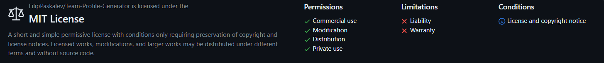

# Team-Profile-Generator

## Description

This Node.js command-line application allows you to generate a webpage that displays basic information about your software engineering team. It prompts the user to input details about the team members, including the manager, engineers, and interns, and then generates an HTML file based on the provided information.

## User story

As a team manager, I require a convenient way to compile and access essential information about my software engineering team. This tool enables me to swiftly generate a webpage displaying key details, such as names, roles, email addresses, and GitHub profiles, for each team member. This streamlines communication and collaboration within the team, enhancing productivity and efficiency.

I want to be able to:

- Input the details of the team manager, including their name, employee ID, email address, and office number.
- Add engineers to the team, including their name, ID, email, and GitHub username.
- Add interns to the team, including their name, ID, email, and school they are attending.
- Finish building the team when all necessary members have been added.
- Have an HTML file generated automatically containing all the team members' information, which I can refer to later for reference.

## Features

- Utilizes Node.js for command-line interface.
- Prompts users for information about each team member.
- Supports different roles within the team, including managers, engineers, and interns.
- Automatically generates an HTML webpage based on the provided information.
- Includes tests to ensure the correctness and functionality of the application.

## Technologies
- [Node.js *v21.6.1*](https://nodejs.org/en)
- [Inquirer *v8.0.0*](https://www.npmjs.com/package/inquirer/v/8.0.0#documentation)
- [Jest *v29.7.0*](https://jestjs.io/)
- [HTML](https://html.com/)
- [Bootstrap](https://getbootstrap.com/)
- [CSS](https://www.w3.org/Style/CSS/Overview.en.html)
- [JavaScript](https://www.javascript.com/)
- [Prettier *v3.2.5*](https://prettier.io/)
- [Git](https://git-scm.com/)
- [JSDoc *v4.0.2*](https://jsdoc.app/)

## Usage

1. Clone the repository to your local machine.
2. Navigate to the project directory in your terminal.
3. Install dependencies using ```npm install```.
4. Run the application using ```npm start```.
5. Follow the prompts to input information about each team member.
6. Once all information is provided, the application will generate an HTML file named ```team.html``` in the ```output``` directory.

## Classes
This application utilizes classes for each team member:

```Employee```: Parent class with properties and methods for **name**, **ID**, **email**, and **role**.

```Manager```: Extends Employee with an additional property for **office number** and an **overridden getRole()** method.

```Engineer```: Extends Employee with an additional property for **GitHub username** and an **overridden getRole()** method.

```Intern```: Extends Employee with an additional property for **school** and an **overridden getRole** method.

## Tests

Unit tests for each class are provided in the ```__tests__``` directory. Ensure that all tests pass using ```Jest```.

## Resources

### NPM

[Link 1](https://www.geeksforgeeks.org/introduction-to-npm-scripts) | 
[Link 2](https://docs.npmjs.com/cli/v10/using-npm/scripts) | 
[Link 3](https://docs.npmjs.com/cli/v6/commands/npm-test) | 
[Link 4](https://docs.npmjs.com/cli/v6/commands/npm-start) | 
[Link 5](https://www.knowledgehut.com/blog/web-development/package-json-scripts-node-js)
[Link 1](https://codedamn.com/news/nodejs/remove-npm-package)
[Link 2](https://docs.npmjs.com/uninstalling-packages-and-dependencies)

### JavaScript

[Link 1](https://www.sohamkamani.com/javascript/enums/) | 
[Link 2](https://developer.mozilla.org/en-US/docs/Web/JavaScript/Reference/Classes/constructor) | 
[Link 3](https://developer.mozilla.org/en-US/docs/Web/JavaScript/Guide/Using_classes) | 
[Link 4](https://developer.mozilla.org/en-US/docs/Web/JavaScript/Reference/Classes) | 
[Link 5](https://developer.mozilla.org/en-US/docs/Web/JavaScript/Reference/Functions/set) | 
[Link 6](https://developer.mozilla.org/en-US/docs/Web/JavaScript/Reference/Classes/Static_initialization_blocks) | 
[Link 7](https://developer.mozilla.org/en-US/docs/Web/JavaScript/Reference/Classes/constructor#examples) |
[Link 8](https://stackoverflow.com/questions/21194934/how-to-create-a-directory-if-it-doesnt-exist-using-node-js) |
[Link 9](https://stackoverflow.com/questions/13696148/node-js-create-folder-or-use-existing) |

[Link 10](https://nodejs.org/en/learn/manipulating-files/reading-files-with-nodejs)

[Link 11]()
[Link 12]()
[Link 13]()
[Link 14]()

### Jest

[Link 1](https://jestjs.io/docs/cli#--testnamepatternregex) | 
[Link 2](https://jestjs.io/docs/configuration) 

[Link 9]()
[Link 10]()
[Link 11]()
[Link 12]()
[Link 13]()
[Link 14]()

### inquirer

[Link 1](https://github.com/sboudrias/Inquirer.js) | 
[Link 2](https://www.npmjs.com/package/inquirer/v/8.0.0) 

[Link 9](https://www.digitalocean.com/community/tutorials/nodejs-interactive-command-line-prompts)

[Link 10](https://github.com/SBoudrias/Inquirer.js#plugins)

[Link 11](https://github.com/SBoudrias/Inquirer.js/blob/master/packages/inquirer/README.md)
[Link 12]()
[Link 13]()
[Link 14]()

### Prettier

[Link 1](https://prettier.io/docs/en/configuration.html) | 
[Link 2](https://prettier.io/docs/en/options.html#print-width) | 
[Link 3](https://prettier.io/docs/en/options.) | 
[Link 4](html#:~:text=For%20readability%20we%20recommend%20against,up%20long%20lines%20for%20readability.) | 
[Link 5](https://stackoverflow.com/questions/45404823/how-to-remove-semicolons-in-prettier) | 
[Link 6](https://prettier.io/docs/en/ignore.html) 

[Link 9]()
[Link 10]()
[Link 11]()
[Link 12]()
[Link 13]()
[Link 14]()

### Chalk
[link 1](https://www.npmjs.com/package/chalk)
[Link 2](https://github.com/chalk/chalk)
[link 3](https://github.com/chalk/chalk#readme)
[Link 4](https://stackoverflow.com/questions/70309135/chalk-error-err-require-esm-require-of-es-module)
[Link 5](https://www.npmjs.com/package/chalk/v/4.1.2)
[]()
[]()
[]()
[]()

### Bootstrap
[Link 1](https://getbootstrap.com/docs/4.0/utilities/spacing/)
[Link 2](https://getbootstrap.com/docs/4.3/utilities/sizing/)
[Link 1]()
[Link 1]()
[Link 1]()
[Link 1]()
[Link 1]()
[Link 1]()

## Contributing

Contributions to this project are welcome. Feel free to submit bug reports, feature requests, or pull requests.

## Questions

If you have any questions about this projects, please contact me directly at paskalevFilip@gmail.com. You can view more of my projects at [https://github.com/FilipPaskalev](https://github.com/FilipPaskalev).

## License



This project is licensed under the MIT License, you can find link to the license  [here](https://github.com/FilipPaskalev/Team-Profile-Generator/blob/main/LICENSE).